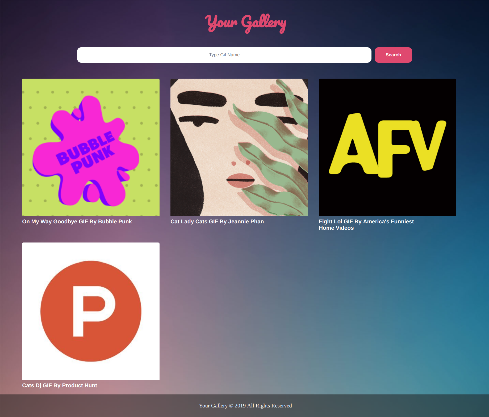

# **Your Gallery**
Your Gallery web app  - by using giphy API .

## **Our Idea :**
  A Website that display Some Giphy images when we search about the topic . 

## **Our website Prototype :** 

## **WHY ?**
  Our webiste request API in the back and fetch data in the backend to filter the required data and display it for the user.

## **WHAT ?**
  Our Gallery website is a single page that help our clients in displaying their searched giphy images . 

## **HOW ?**
We divided our project in to Stages:
 
* Searching for suitables API's :
  we started our work by searching for the suitable API  which is should be Free and have unlimited number of requests so we choose giphy API .

* Design :  
  We design our project on papers to make a general perception for the website.

* Project Structure : 
  We started to build our project files Structure by seprate our project into three folders which is public,src which include (views and controllers)and test to make our work more organized.

* Setup Travis in our project : 
  We setup travis in the begining of our project to test our project with its test step by step . 

* Divided Tasks :
  We divided the work in tasks and started to work as pairs.

* Making tests : 
  we made tests for our routes and logic functions to check that they were work well .

* Fetching Data From API : 
  We work in Fetching data from API in the back end by fetch API using node-fetch and  make views and routers in server to render them late.

* Displaying Data In Page : 
  We show our fetched data using node-fetch and render them.

* Refactor code : 
  we made refactor for our code to raise our code performance .

* Design Website : 
  We make the design for our page to obtain the required shape from our idea and be sure that it works in mobile status as required.

* Responsive and Accessbility : 
  We chekout the Responsive case especially mobile status for our design and also check accessbility for the app to work in the better case.

* Use Heroku :
  we use our Heroku to connect it with github and have a link to our project . 

* Checking and Fixing issues : 
  Solve The issues that appears and take suggestions in mind and try to add it all to have a great website . 

* Handle Errors

## **User Journey :** 
* The User open our Website and see Landing page that contain descriptive header for using our page.
* The User can see our contact details by contact us form.
* The User can type the image name and get gifs for it .
* The User reach to footer section that have the contact detials.

## **Continuous Integration (CI) :**
we use travis for cI to check our project with the test to be sure from our work .

## **Code Coverage :**
we use Nyc code coverage method to be sure from our tests .

## **Used API :**

> The giphy API [Giphy website](https://giphy.com/)
  you can find it by : [GipgyAPI](https://developers.giphy.com/)

